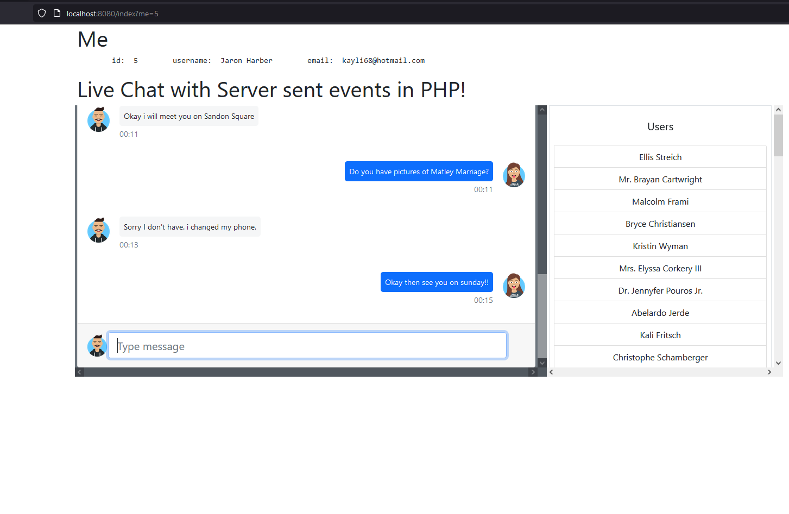

CODE FOR BLOG: Live chat application with Server Sent Events in PHP.
-------------------------------------------------------------------

GETTING STARTED:
---------------
* Clone this repo into your machine and run `composer install` to install the app (in the root dir of this project)
dependencies that the app relies on.
* Run  `php -S localhost:8080` to start the app at `http://localhost:8080/`.
* Open different (incognito) tabs and open any users already in the `srcdata.sqlite` and load
different users, like so `http://localhost:8080/index?me=5` and `http://localhost:8080/index?me=1` where 5 and 1
are real user ids from the users table.

Commands:
--------
* `vendor/bin/doctrine orm:schema-tool:create` to create entity schemas in our database as defined in
 `src/Entity` and `cli-config.php`.

Resources:
----------
* Chat template @https://mdbootstrap.com/docs/standard/extended/chat/
* SSE wrapper @ https://github.com/hhxsv5/php-sse
* Adding timestamps @ https://gist.github.com/muzfr7/7ec1b726702e3d353e83246dce22eab3